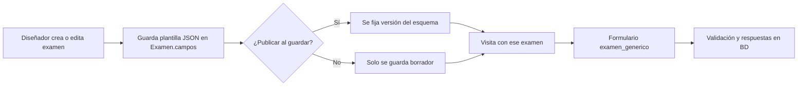
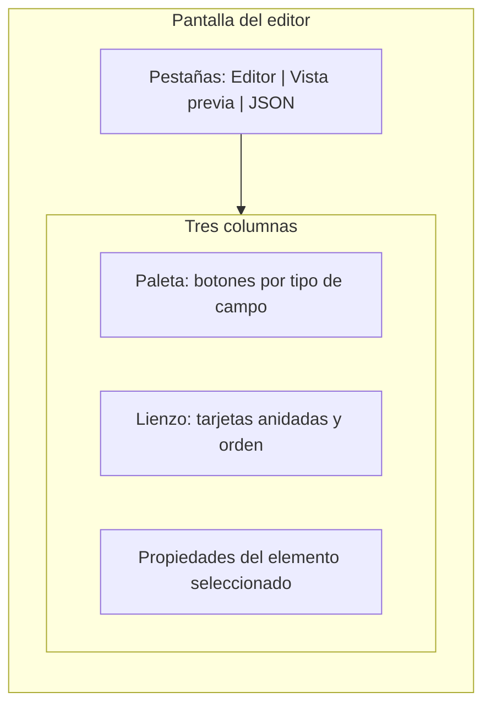
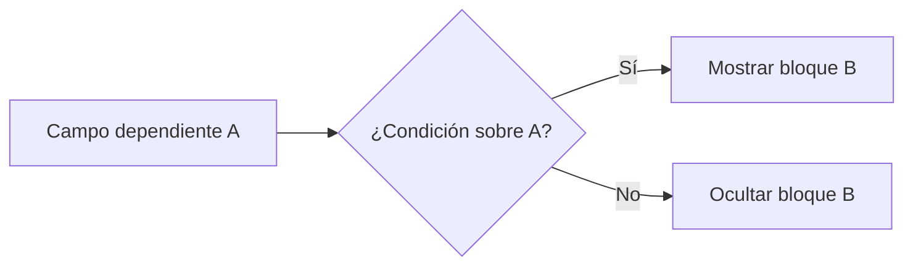
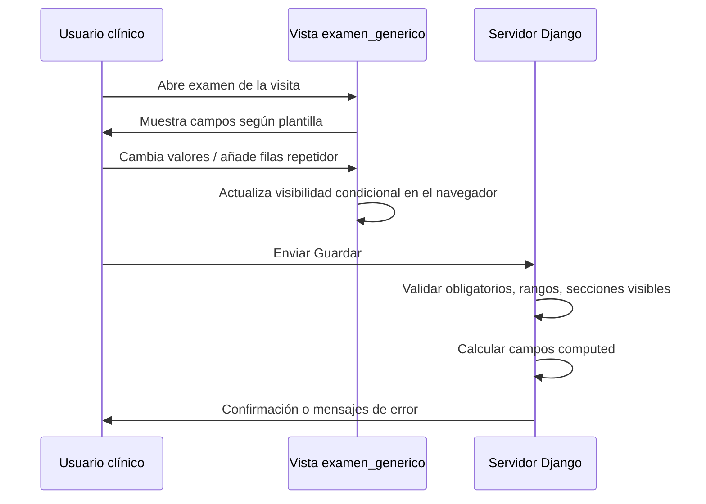
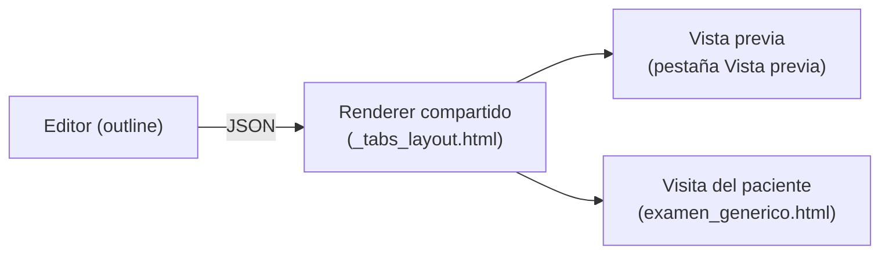

# Manual de usuario — Form Builder (exámenes dinámicos)

Este documento explica **cómo usar el constructor visual de exámenes** en Atenea: qué hace cada tipo de campo, cómo se organizan en pantalla y cómo fluye la información desde el diseño hasta el guardado de respuestas.

**Audiencia:** personal que diseña o mantiene plantillas de examen (administración / coordinación clínica).

**Referencia técnica del JSON:** [analysis/FORM_BUILDER_SCHEMA.md](analysis/FORM_BUILDER_SCHEMA.md).

---

## 1. ¿Qué es el Form Builder?

El **Form Builder** permite definir un examen como una **lista ordenada de bloques y campos** (texto, números, listas, secciones, tablas repetibles, valores calculados, etc.). Esa definición se guarda en el examen y, cuando un paciente tiene una visita con ese examen, el sistema **genera el formulario automáticamente** y valida las respuestas al guardar.

---

## 2. Pantalla del editor (tres zonas)

Al **editar un examen** del builder verá tres columnas principales y pestañas arriba.

| Zona | Uso |
|------|-----|
| **Paleta** | Añade un **nuevo** bloque o campo del tipo elegido (sección, texto, número, etc.). Tiene **buscador rápido** (atajo `/`) y **drag & drop** hacia el lienzo. La paleta es **contextual**: si tiene una sección o repetidor seleccionado en el lienzo, el clic añade el campo dentro de ese contenedor. Active la casilla *"Añadir siempre a raíz"* para forzar el nivel raíz. |
| **Lienzo** | Muestra la **estructura** del formulario como árbol. Puede **arrastrar** tarjetas (incluido desde la paleta) para colocar y reordenar. Cada tarjeta tiene acciones (eliminar, duplicar, subir/bajar). Las secciones top-level llevan un **número** (la pestaña que verá el paciente) y un icono `◎` si tienen visibilidad condicional. |
| **Propiedades** | Al **seleccionar** una tarjeta en el lienzo, aquí se editan etiqueta, id, obligatoriedad, opciones, condiciones de visibilidad, etc. |

### Pestañas

- **Editor:** diseño habitual (paleta + lienzo + propiedades).
- **Vista previa:** genera una vista de solo lectura del formulario (útil para revisar antes de publicar). Use el botón de actualizar vista previa si está disponible.
- **JSON:** muestra el **contenido exacto** que se guardará (`campos_json`). Avanzado; sirve para copiar o auditar la plantilla.

---

## 3. Flujo de trabajo recomendado

---

## 4. Componentes de la paleta (qué hace cada uno)

Todos los campos con valor (excepto la **sección**) tienen un **`id`**: es la **clave** con la que se guardan los datos. Debe ser **único** en todo el examen y conviene que sea estable (no cambiarlo a la ligera si ya hay datos guardados).

### Sección

- **Qué es:** un **título de bloque** que agrupa otros campos **por debajo** en el árbol.
- **Propiedades:** etiqueta, texto de ayuda opcional, **visibilidad condicional** opcional.
- **Comportamiento en el editor:** se ve como una tarjeta anidada con sus campos hijos. Tiene un botón **«+ Añadir campo»** que despliega TODOS los tipos permitidos para añadir directamente dentro.
- **Comportamiento en el paciente / vista previa:** cada sección top-level se muestra como una **pestaña** (ver §11). Si la sección está oculta por condición, su pestaña desaparece y, si era la activa, el sistema cambia automáticamente a la primera visible. En el servidor **no se exigen** validaciones de los campos internos de una sección oculta.
- **Restricción:** no se permite anidar secciones dentro de secciones, ni anidar repetidores dentro de repetidores. El editor lo bloquea al guardar.

### Texto corto (`text`)

- **Qué es:** una línea de texto o, si activa **entrada multilínea**, un área de texto con varias filas configurables.
- **Propiedades:** id, etiqueta, obligatorio, ayuda, multilínea, filas (altura).

### Texto largo (`textarea`)

- **Qué es:** área de texto amplia (similar a `text` multilínea pero como tipo propio).

### Número

- **Qué es:** valor numérico con controles HTML5.
- **Propiedades:** mínimo, máximo, **paso** (`step`, por ejemplo `0.1` o `1`), obligatorio.

### Fecha / Hora / Correo

- **Fecha:** selector de fecha.
- **Hora:** selector de hora.
- **Correo:** validación de formato de email en el navegador.

### Lista desplegable (`select`)

- **Qué es:** el usuario elige **una** opción de una lista.
- **Propiedades:** **opciones** (cada una con `value` interno y `label` visible). Puede **reordenar** opciones con ↑ / ↓ en el editor.

### Opción única — radio (`radio`)

- **Qué es:** igual que la lista conceptualmente, pero todas las opciones se ven a la vez como botones de radio.

### Casilla (`checkbox`)

- **Qué es:** una sola casilla (sí/no almacenado como valor booleano en datos).

### Sí / No (`boolean`)

- **Qué es:** dos radios explícitos «Sí» y «No».

### Múltiple opción (`multiselect`)

- **Qué es:** varias casillas; la respuesta guardada es una **lista** de valores.
- **Propiedades:** mismas opciones que `select`; reordenables.

### Repetidor

- **Qué es:** una **tabla dinámica**: el usuario puede añadir **filas**; cada fila repite los subcampos definidos dentro del repetidor.
- **Propiedades:** id, etiqueta, obligatorio (al menos una fila), texto del botón **«agregar fila»** (`add_label`), ayuda, subcampos anidados en el lienzo, visibilidad condicional del bloque entero.
- **Nota:** los nombres técnicos en el navegador llevan prefijos `idRepetidor__n__subcampo`. La **visibilidad condicional** que dependa de un campo **solo dentro** de una fila tiene limitaciones; lo más seguro es condicionar respecto a campos **fuera** del repetidor o al mismo nivel.

### Calculado

- **Qué es:** campo **de solo lectura** cuyo valor calcula el **servidor** al guardar (y puede mostrarse en vivo en algunos casos, p. ej. IMC).
- **Propiedades:** fórmula, número de decimales, **dependencias** (qué otros `id` intervienen), ayuda.
- **IMC:** fórmula especial `imc` con dependencias típicamente peso (kg) y talla (cm); el sistema aplica la fórmula clínica habitual.

---

## 5. Visibilidad condicional («Mostrar solo si…»)

Permite **mostrar u ocultar** un bloque (sección, repetidor o campo) según el valor de **otro campo que aparece antes** en el formulario (orden en el lienzo).

| Condición en la interfaz | Significado breve |
|--------------------------|-------------------|
| **Igual a** | El valor actual debe coincidir con el esperado. |
| **Distinto de** | Debe ser diferente al esperado. |
| **Contiene** | Para texto, si el texto incluye el fragmento; para multiselect, si la lista incluye el **value** de la opción elegida. |

El editor adapta el control de **valor esperado** al tipo del campo dependiente (lista, número, sí/no, texto).

---

## 6. Orden, duplicado y validaciones del editor

- **Arrastrar** tarjetas en el lienzo reordena el formulario (incluido dentro y entre secciones / repetidores). También se puede arrastrar **desde la paleta** directamente al contenedor deseado.
- **Duplicar** crea una copia; el sistema suele **sufijar el id** para evitar colisiones — revíselo en propiedades.
- **Atajos de teclado del editor:**
  - `/` enfoca el buscador de la paleta.
  - `Esc` cancela un arrastre activo o cierra menús abiertos.
  - `Shift + ↑` saca el campo seleccionado de su sección/repetidor (lo sube un nivel).
  - `Shift + ↓` introduce el campo seleccionado en la siguiente sección/repetidor hermana.
- Al **guardar** el examen, el cliente bloquea el envío si faltan **ids**, hay **ids duplicados**, opciones vacías en listas, un calculado sin fórmula o sin dependencias, o si hay anidación inválida (sección dentro de sección, repetidor dentro de repetidor). Avisos no bloqueantes (confirmación): más de 9 secciones, etiquetas de sección duplicadas, vacías o muy largas (>28 caracteres, se truncan en pestañas).

---

## 7. Guardar examen y publicación

- El formulario de edición del examen envía la definición en **`campos_json`**.
- Si marca **«Publicar al guardar»** (u opción equivalente en su pantalla), el sistema **fija una versión del esquema** alineada con ese JSON, lo cual ayuda a trazabilidad cuando las respuestas se asocian a una versión concreta de la plantilla.
- Si no publica, los cambios pueden quedar como **borrador** según la política del sistema; consulte con su administrador cuándo es obligatorio publicar.

---

## 8. Experiencia del usuario en la visita (rellenar el examen)

- Los campos obligatorios muestran **asterisco** en la etiqueta.
- El botón **Guardar** envía todo el formulario; los errores de validación los muestra el servidor (y el navegador en campos HTML5 como `required`).

---

## 9. Resumen rápido por tipo

| Componente | Dato que guarda | Ocasión de uso típica |
|------------|-----------------|------------------------|
| Sección | (no tiene valor propio) | Agrupar temas |
| Texto / Textarea | Texto | Observaciones, notas |
| Número | Número | Peso, talla, escalas |
| Fecha / Hora / Email | Valor tipado | Epidemiología, citas, contacto |
| Select / Radio | Un `value` | Opciones cerradas |
| Checkbox / Boolean | Booleano | Preguntas sí/no simples |
| Multiselect | Lista de `value` | Síntomas múltiples |
| Repetidor | Lista de filas (objetos) | Medicamentos, familiares, ítems |
| Calculado | Número (u otro según fórmula) | IMC, índices derivados |

---

## 9bis. Pestañas en vista previa y en la visita del paciente

Desde 2026 el formulario que ve el paciente y la **vista previa** del editor renderizan la estructura de la misma forma:

- Cada **sección top-level** del lienzo se convierte en una **pestaña** (numerada en orden).
- Los campos que estén **fuera de toda sección** aparecen como un bloque **«general»** antes de las pestañas.
- Si una sección tiene **visibilidad condicional**, su pestaña aparece solo cuando se cumple la condición; si la pestaña activa deja de cumplir, el sistema selecciona automáticamente la siguiente visible.
- Los **repetidores** y los campos **calculados (IMC, etc.)** funcionan igual dentro de una pestaña.

**Regla operativa**: lo que ve en *Vista previa* es lo mismo que verá el paciente. Use esa pestaña para validar el flujo completo antes de publicar.

### Adaptaciones automáticas

| Situación | Comportamiento |
|-----------|---------------|
| Más de 7 secciones | La barra de pestañas permite scroll horizontal; las etiquetas se truncan a 9rem. |
| Pantalla < 768 px (móvil/tablet) | Las pestañas degradan a **acordeón**: todos los paneles se muestran apilados con su título encima. |
| Sección sin etiqueta | Aparece como `(sin etiqueta)` en la pestaña — corregirlo antes de publicar. |
| Etiqueta > 28 caracteres | Se trunca con `…`; el editor avisa al guardar. |

### Buenas prácticas

- Use **3–7 secciones** por examen; nombres cortos y específicos.
- Coloque preguntas de **filtro** (las que activan visibilidad condicional de otras) en una sección temprana (idealmente la primera).
- Si una sección agrupa subgrupos (p. ej. *Examen físico → Cabeza, Tórax, Abdomen*), evalúe usar **secciones separadas** en lugar de anidar visualmente con texto en las etiquetas.

---

## 10. Dónde encontrar las pantallas en la aplicación

Las rutas internas de Django suelen incluir (nombres `name` en `urls.py`):

- `exam_builder_list` — listado de exámenes del builder  
- `exam_builder_create` — crear examen nuevo  
- `exam_builder_edit` — editor visual descrito en este manual  

La URL exacta depende del prefijo montado en su instalación (`/.../`). Si no la conoce, pídala al administrador o búsquela en el menú de administración de exámenes / visitas.

---

*Última actualización: paleta contextual y drag & drop hacia secciones, atajos de teclado (`/`, `Esc`, `Shift + ↑/↓`), pestañas en runtime y vista previa (renderer compartido `_tabs_layout.html` + `runtime.js`), validación de anidación, avisos de cantidad de secciones y etiquetas largas. Ver [analysis/FORM_BUILDER_DND_TABS_ADR.md](analysis/FORM_BUILDER_DND_TABS_ADR.md) para la decisión y los detalles técnicos.*
